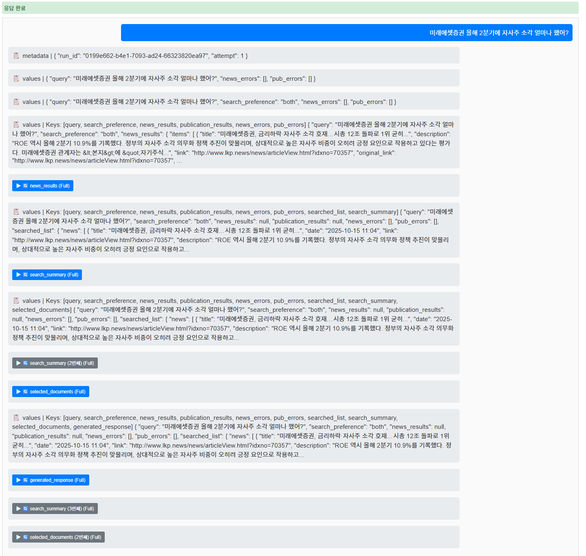
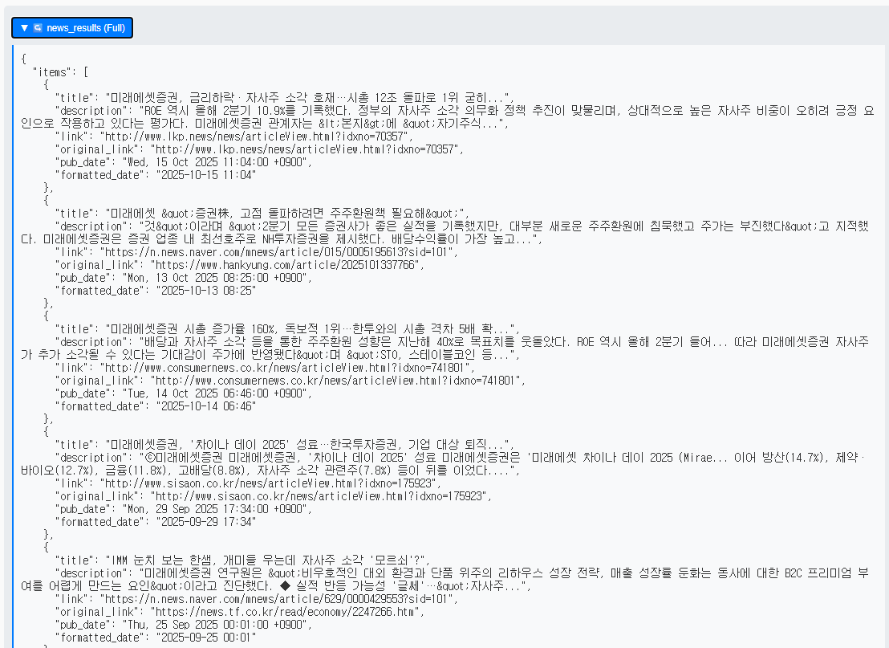

# 루머 에이전트 비동기 처리 과정
langgraph cli를 이용해 agent를 만들었을 때, 비동기로 응답을 받는 방법 확인을 위해 chatbot.html을 만듦.

## 전체 시스템 구성도
| 구성 요소 |
|----------|
|  |

## 시스템 주요 기능

| 뉴스 | 검색 항목 |
|------|----------|
|  |  |

| 필터링된 문서 | 응답 |
|-------------|------|
|  |  |